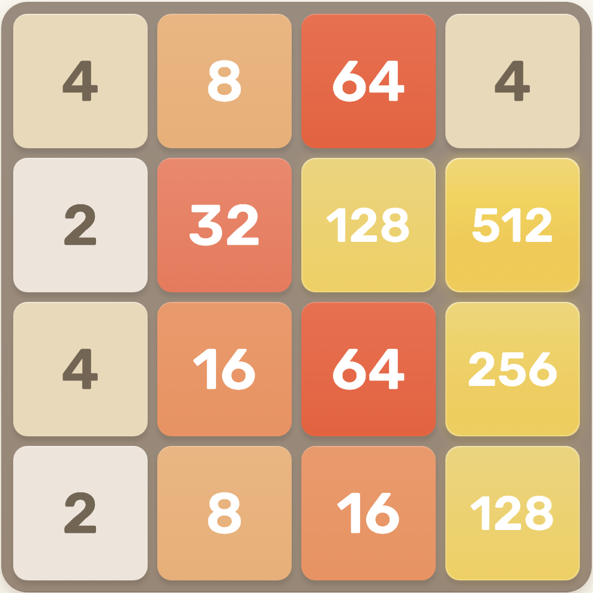

# PIC 16A - 2048 and friends

This exercise has two purposes.
 - Because one does not have to declare variables like in C++,
   some people mistakenly think that Python does not have datatypes.
   This exercise emphasizes that Python does have datatypes
   and that paying attention to them is often useful.
 - It shows that intimidating math problems can often
   be attacked by a computer without too much difficulty.

## Powers of 2

You might have played the game [2048](https://play2048.co/){:target="_blank"} before.

You can see that this game involves the numbers

  \[
    2,\ 4,\ 8,\ 16,\ 32,\ 64,\ 128,\ 256,\ 512.
  \]

These numbers are called *powers of two* because they
are equal to the following numbers, respectively.

  \[
    2^1,\ 2^2,\ 2^3,\ 2^4,\ 2^5,\ 2^6,\ 2^7,\ 2^8,\ 2^9
  \]

For a positive integer $n$,
we can calculate $2^n$ using the following properties.

 - $2^0 = 1$
 - $2^{k + 1} = 2\times 2^k$ for all possible values of $k$

These properties tell us that we can calculate $2^n$ by
starting with $1$ and doubling it $n$ times.

  \[2048\ =\ 2^{11}\ =\ 2\times 2\times 2\times 2\times 2\times 2\times 2\times 2\times 2\times 2\times 2\]

## The leading digit of powers of two

Here is a question that sounds quite intimidating.

> Suppose someone
  picks a power of two ($2^n$ where $n\geq 0$) at random
  and writes down its first digit on a piece of paper.
  If you had to guess what digit they wrote down,
  is there a best option for your guess?

It is an intimidating question for a few reasons.

 - There is math, the most disliked of all the subjects!
 - The word "random".
 - Powers of two get really big, really fast. $2^{64}$ already has 20 digits.

However,
we have become acquainted with Python,
and so we can make some progress on this problem!

If we use the nine powers of two
that we have seen so far,

  \[
    2,\ 4,\ 8,\ 16,\ 32,\ 64,\ 128,\ 256,\ 512
  \]

then we can make the following table.

| Digit | Powers of $2$ for which it is the first digit | Number of times it is the first digit of a power of $2$ so far |
| :---: | :-------------------------------------------: | :------------------------------------------------------------: |
|   0   |                  none                         |                               0                                |
|   1   |                  16 and 128                   |                               2                                |
|   2   |                  2 and 256                    |                               2                                |
|   3   |                  32                           |                               1                                |
|   4   |                  4                            |                               1                                |
|   5   |                  512                          |                               1                                |
|   6   |                  64                           |                               1                                |
|   7   |                  none so far                  |                               0                                |
|   8   |                  8                            |                               1                                |
|   9   |                  none so far                  |                               0                                |

This does not reveal a pattern,
but we can hope that a pattern
emerges when we use more data.
It would be tedious for us
to calculate many
powers of two
by hand or
with a calculator,
but we can make Python
calculate these numbers for us.

## Picking off the first digit of a number

One can think about picking off the first digit of a number in two distinct ways.
Suppose the number is 314159265, so that the first digit is 3.

 1. **METHOD 1 (Difficult).**
    The first method to pick off the first digit involves math.
    

      \[
        3\ =\ \left\lfloor     3.14159265                                          \right\rfloor\ 
           =\ \left\lfloor\frac{314159265}{100000000                              }\right\rfloor\ 
           =\ \left\lfloor\frac{314159265}{10^8                                   }\right\rfloor\ 
           =\ \left\lfloor\frac{314159265}{10^{\lfloor\log_{10}(314159265)\rfloor}}\right\rfloor
      \]
    

    Therefore, $\left\lfloor\frac{m}{10^{\lfloor\log_{10}(m)\rfloor}}\right\rfloor$
    gives a formula for the first digit of a positive integer $m$.

    This is completely reasonable,
    but the second method is much simpler.

 2. **METHOD 2 (Easier).**
    Forget about thinking of 314159265 as a number.
    Just think of it as a sequence of characters,
    a *string*, and ask for the `0`-th character.

In Python, we have distinct datatypes `int` and *string* (`str`).
By converting between them, the second method can be implemented.

## Addressing the $2^n$ problem

After working on `hw1_q1.py`,
return to this question.

> Suppose someone
  picks a power of two ($2^n$ where $n\geq 0$) at random
  and writes down its first digit on a piece of paper.
  If you had to guess what digit they wrote down,
  is there a best option for your guess?

<textarea id="first_digit_of_power_of_two" rows="1" cols="6"></textarea>
<input type="button" value="Submit" id="first_digit_of_power_of_two_submit">

> Does your function `occurrences_as_first_digit_of_a_power_of_two` demonstrate anything more than this?
