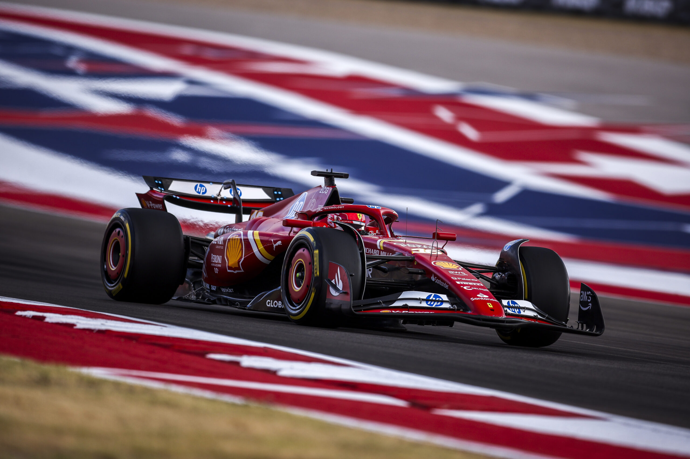
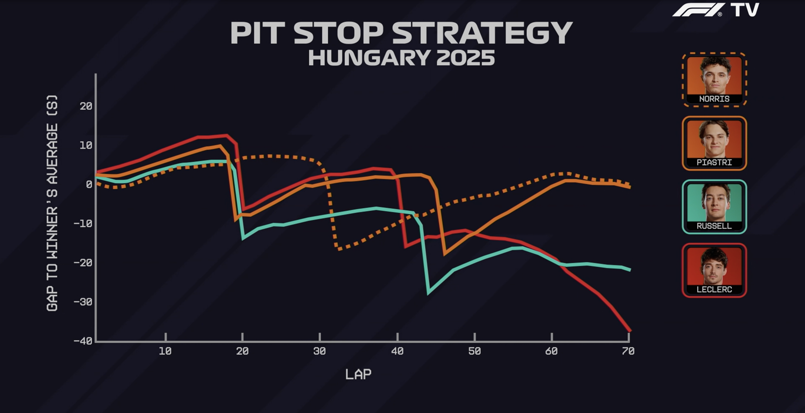
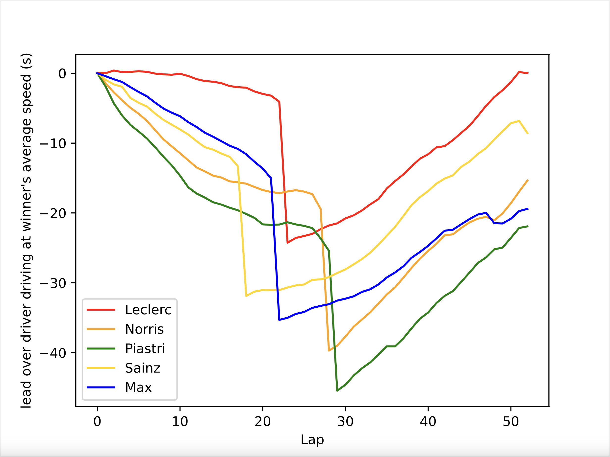

# PIC 16A - Creating Graphics For F1 TV with Pandas





## About a Formula One Race

*Formula One (F1)* races involve around 20 drivers
driving their cars around a racetrack.
One complete traverse of a racetrack is referred to as a *lap*.
The number of laps in a race varies from racetrack to racetrack,
but a race consists of between 40 and 80 laps.
The goal is to cross the finish line first.
Since the drivers drive very quickly, up to 234.9 mph,
their tires deteriorate lap by lap.
Ignoring some subtleties, new tires are faster than old tires.
Drivers can take *pit stops* when they wish to change their tires.
However, since a pit stop involves stopping, other drivers might overtake them!
Using electronic tracking devices, each lap of a driver's race is timed precisely to within 1 millisecond.


## Introducing the F1 TV Graphics using Hungary 2025

On 8/3/2025, F1 TV showed the following graphic
for the Hungarian Grand Prix to show the progress
of the four top-finishing drivers:
 - Lando **Norris**,
 - Oscar **Piastri**,
 - George **Russell**,
 - Charles **Leclerc**.



The graph was intuitive to read
*for those who watched the race*.
However, the $y$-axis is misleadingly labeled
and it caused an expert of mathematics and a fan of F1
to stop and ponder the graphic for a good amount of time.
Therefore, it is quite reasonable to be confused by it,
but perhaps you can answer the following questions.
Thinking about these questions will help you
to start interpreting the graph.

 - Who do you think won the race?
   The internet knows!
 - Who was in the lead after lap 10?
 - Who was furthest back of the four drivers after lap 10?
 - Who was in the lead after lap 25?
 - Who was furthest back of the four drivers after lap 25?
 - Who was in the lead after lap 35?
 - Who was furthest back of the four drivers after lap 35?
 - Who was second and third on lap 50?


## Introducing the Homework Assignment

In this Homework Assignment,
you will create a similar graphic
for **a different Formula One race:
Circuit of the Americas (COTA) 2024**
using race data obtained from
[www.fia.com](https://www.fia.com){:target="_blank"}.
 - Doing so will help you to better understand
   the graphic for Hungary, and below,
   there are more questions about Hungary 2025
   to test your improved understanding.
 - First,
   there are some questions specific to COTA 2024.
   To answer them,
   you can either use the graphic that you produce
   or fall back on the original data if necessary.

Note that starting with data and using it to produce a graphic
that is understandable to millions of F1 viewers around the globe
is Applied Data Science!
Perhaps one of you will work for F1 TV one day
and you will be able to obtain a grid pass for me
so that I can meet my favorite rookie, Fernando Alonso.


## The Homework Assignment


### Race data

Race data for
the Circuit of the Americas (COTA) in 2024
can be downloaded [here](./cota_24_pd.csv).
Note that the drivers involved are:
 - Charles **Leclerc**,
 - Lando **Norris**,
 - Oscar **Piastri**,
 - Carlos **Sainz**,
 - **Max** Verstappen
   (a multiple world champion,
   so his first name identifies him
   to anyone who knows a thing
   or two about Formula 1).

**ASIDE.**
For those who know and love Formula 1,
the times of the first five laps
were impacted by a safety car;
they have been replaced
to make the data nicer to work with.

<br>


### Plotting the data

You can plot this data
using Pandas very quickly.
The following code does that.

```python
import numpy as np
import pandas as pd

laps = pd.read_csv('cota_24_pd.csv', index_col='Lap')


processed = laps  # Needs substantial editing!!


y_axis_label = "lead over driver driving at winner's average speed (s)"

processed.plot(color=['red', 'orange', 'green', 'gold', 'blue'], ylabel=y_axis_label)
```

A notebook containing this code
is available [here](./f1.ipynb)
("right"-click and select "Save Link As...").

<br>


### What you need to submit to Gradescope

By replacing the line which says `processed = laps`
by some other lines of code which process the data,
the following chart can be produced.



 - Replace the line
   `processed = laps`
   by the necesssary lines of code
   so that the chart above is produced.
 - Submit `f1.ipynb` to Gradescope.
 - If you struggle to get started,
   following [this tutorial](./f1-sh.md){:target="_blank"},
   which guides you
   to solve the same problem
   using Google Sheets,
   may be very helpful for you.

A couple of remarks...

 - For my own solution, I replaced
   `processed = laps` by just six lines of code.
   I think that those six lines are much more rewarding
   if you gradually work towards understanding the problem
   and you see a slower way to solve it first.
 - Note that my graph starts on Lap 0 where
   all drivers are plotted with a "y-value" of 0.
   On a related note,
   there is an extra row in the data prepared for Google Sheets
   when you compare it with the data prepared for Pandas.


## Data Analysis

You do not need to turn in the answers to these questions.
However, they are the entire point of all of this!
Why are you learning Python?
Probably because it is
the language most used by Data Scientists.
What do Data Scientists do?
They seek out patterns in data,
and try to interpret them correctly.
Answering these questions tests
some of your progress
towards being a Data Scientist
or a person who can process data using Python.

<br>


### COTA 2024


Using the chart that you just created,
answer the following questions.

 - Who won the race?
 - Between Norris and Max, who was ahead on lap 35?
 - Between Norris and Max, who was ahead on lap 50?
 - Therefore, between Norris and Max, who was faster on average between lap 35 and lap 50?
 - Between lap 30 and lap 38, were any of Max's lap times shorter than Norris'?
   - **Note.** If the chart does not reveal the answer to you, then you can look at the original data.
   - What aspect of the chart supports your answer to this question?
 - What significant event took place on lap 48?
 - Was the time difference between
   the drivers involved in the event on lap 48
   more or less than 5 seconds *at the end of the race*?
 - Norris received a 5-second penalty,
   and this was added to his total time
   after the race.
   Accounting for Norris' penalty,
   what was the finishing order of the drivers?
 - At this circuit, drivers enter the pits
   to change their tires at the *end* of their lap,
   and this causes their *next* lap to be much slower.
   - What significant event took place on lap 17?
   - What significant event took place on lap 21?
   - What was the lasting consequence of these two events for the two drivers involved?<br>
     This is called an "undercut" and is the result of newer tires being faster than older tires.
 - For fans of Formula 1 who remember the exact laps that these events occurred on,
   you might notice that the lap numbers are incorrect. This is because the data
   was "cleaned" to ignore the safety car at the start of the race.


<br>


### Hungary 2025


We can now understand Formula 1 TV's graphic much better!

 - Who had the most depressing race? This is a common theme in F1.
 - From lap 22 to lap 26 who was faster -- Norris or Piastri?
 - From lap 52 to lap 58 who was faster -- Norris or Piastri?
 - Ignoring the pit stops, for the most part, who was faster -- Norris or Piastri?
 - Who won the race?
 - How was Norris' pit stop strategy different than that of
   Piastri, Russell, and Leclerc in Hungary 2025?
 - "The driver who drives the fastest always wins the race." True or false? 

